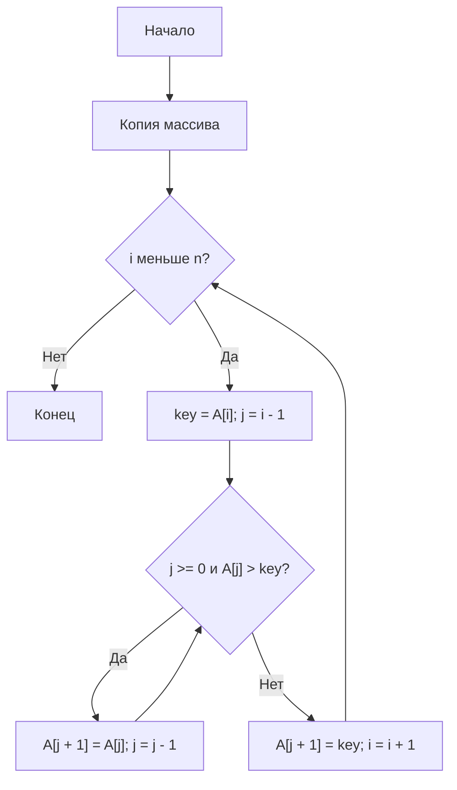
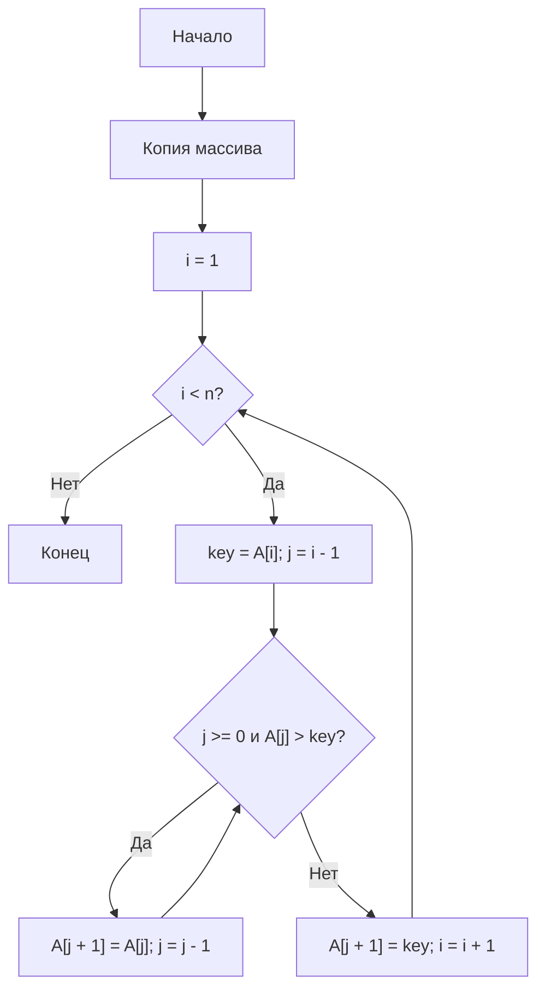

# Отчёт — Лабораторная работа №2, вариант 0

**Осипова Анна Алексеевна**

## Цель
Освоить экспериментальное исследование временной сложности алгоритмов сортировки.

## Задание
Исследовать пузырьковую сортировку и сортировку вставками на случайных целых числах `[0; 100000]` для `n = 500, 1000, 2000, 3000, 4000, 5000`. Каждый замер повторяется 3 раза, берётся медиана.

## Теория
Оба алгоритма имеют `Theta(n^2)` в среднем и худшем случае, `Theta(n)` в лучшем случае и `O(1)` дополнительной памяти. Сортировки устойчивы.

## Блок-схема пузырька

## Блок-схема вставок

## Результаты
`results.csv` содержит времена и `T(n)/n²`, `results.txt` — протокол запуска, `lr2_plot.png` — график. Для квадратичного роста отношение `T(2n)/T(n)` теоретически стремится к 4.

## Вывод
Эксперимент позволяет проверить соответствие двух реализаций теоретической оценке `Theta(n²)` на одинаковых входных данных.
