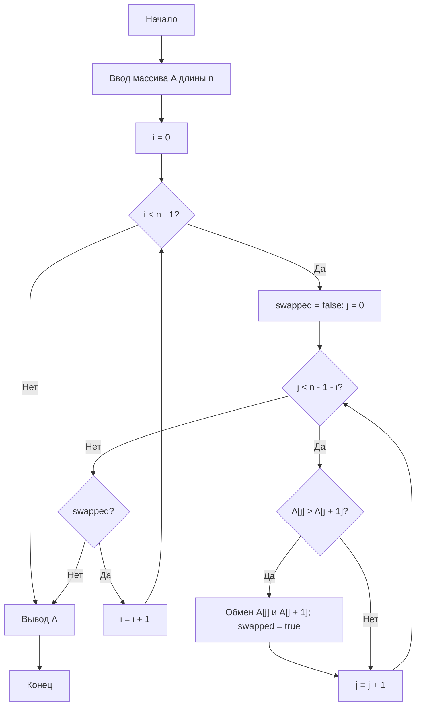
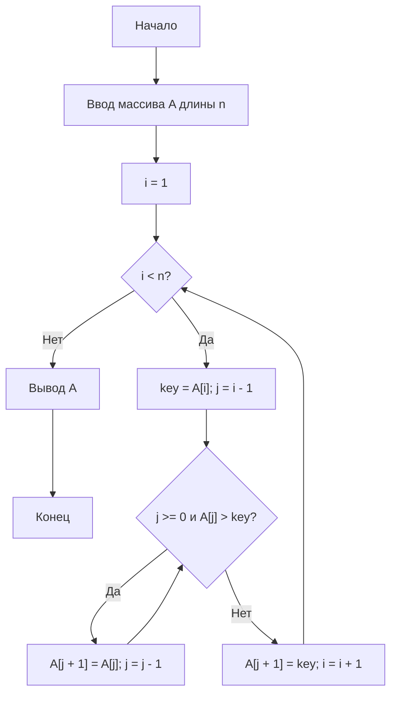

# Отчёт — Лабораторная работа №2, вариант 0

**Осипова Анна Алексеевна**

## Цель

Освоить экспериментальное исследование временной сложности алгоритмов сортировки и сравнить практическое время работы сортировки пузырьком и сортировки вставками с их теоретическими оценками сложности.

## Задание

Сравнить время работы сортировки пузырьком с флагом досрочного выхода и сортировки вставками на случайных целочисленных массивах из диапазона `[0; 100000]` для размеров:

`n = 500, 1000, 2000, 3000, 4000, 5000`.

Каждое измерение повторяется **3 раза**, итоговым значением считается **медиана**. Для проверки правильности сортировки результат сравнивается с результатом встроенной функции `sorted()`.

## Теория

### Сортировка пузырьком

Сортировка пузырьком последовательно сравнивает соседние элементы массива и меняет их местами, если они расположены в неправильном порядке. В реализации используется флаг `swapped`, позволяющий завершить алгоритм досрочно, если за проход не было выполнено ни одной перестановки.

* лучший случай: `Θ(n)`;
* средний случай: `Θ(n²)`;
* худший случай: `Θ(n²)`;
* дополнительная память: `O(1)`;
* сортировка является устойчивой.

### Сортировка вставками

Сортировка вставками последовательно рассматривает элементы массива и вставляет каждый очередной элемент на подходящую позицию среди уже отсортированной части массива.

* лучший случай: `Θ(n)`;
* средний случай: `Θ(n²)`;
* худший случай: `Θ(n²)`;
* дополнительная память: `O(1)`;
* сортировка является устойчивой.

## Блок-схема сортировки пузырьком

## Блок-схема сортировки вставками

## Блок-схема экспериментального стенда

## Листинг программы

Основные функции программы:

* `generate_data()` — генерация случайного массива;
* `measure()` — измерение времени работы алгоритма;
* `bubble_sort()` — сортировка пузырьком;
* `insertion_sort()` — сортировка вставками.

Для измерения времени используется `time.perf_counter()`. Для каждого размера массива выполняется три измерения, после чего выбирается медианное значение.

## Характеристики вычислительной системы

Указать характеристики компьютера, на котором выполнялся эксперимент:

* **Операционная система:** macOS
* **Процессор:** указать модель процессора компьютера
* **Оперативная память:** указать объём ОЗУ
* **Версия Python:** указать установленную версию Python

Абсолютное время выполнения зависит от характеристик вычислительной системы, поэтому при повторном запуске значения времени могут немного отличаться.

## Результаты

Файл `results.csv` содержит результаты измерений времени работы алгоритмов и значения `T(n)/n²`.

Файл `results.txt` содержит протокол запуска программы.

Файл `lr2_plot.png` содержит график зависимости времени сортировки от размера массива `n`.

Для квадратичной сложности отношение `T(n)/n²` должно оставаться примерно одного порядка величины.

Также можно использовать отношение:

`T(2n) / T(n)`.

Для алгоритмов с теоретической сложностью `Θ(n²)` при увеличении размера массива в два раза ожидаемое отношение времени стремится к:

`T(2n) / T(n) ≈ 4`.

## Таблица результатов

Результаты необходимо брать непосредственно из файла `results.csv` после запуска программы:

|    n |            Пузырьком, с |            Вставками, с |
| ---: | ----------------------: | ----------------------: |
|  500 | значение из results.csv | значение из results.csv |
| 1000 | значение из results.csv | значение из results.csv |
| 2000 | значение из results.csv | значение из results.csv |
| 3000 | значение из results.csv | значение из results.csv |
| 4000 | значение из results.csv | значение из results.csv |
| 5000 | значение из results.csv | значение из results.csv |

## График

График зависимости времени выполнения алгоритмов от размера массива находится в файле:

`lr2_plot.png`.

## Вывод

В ходе лабораторной работы были реализованы и исследованы сортировка пузырьком с флагом досрочного выхода и сортировка вставками.

Для обеих сортировок экспериментально исследовано время работы на случайных целочисленных массивах различных размеров. Теоретически средняя и худшая временная сложность обоих алгоритмов составляет `Θ(n²)`, а в лучшем случае — `Θ(n)`.

При увеличении размера массива время работы алгоритмов возрастает приблизительно квадратично. Это соответствует теоретическим оценкам сложности. Отношение `T(2n)/T(n)` при увеличении размера массива должно стремиться к 4, что является характерным признаком квадратичного роста.

Обе реализованные сортировки являются устойчивыми и используют `O(1)` дополнительной памяти.
